# 1，Start up
 
Open start_windows.

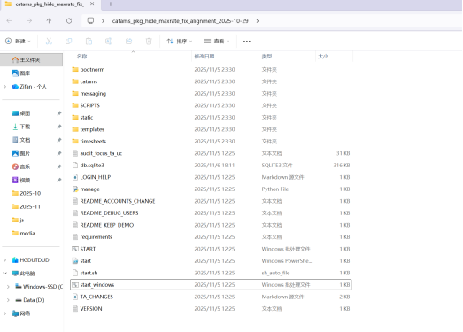

Start at :http://127.0.0.1:8000/

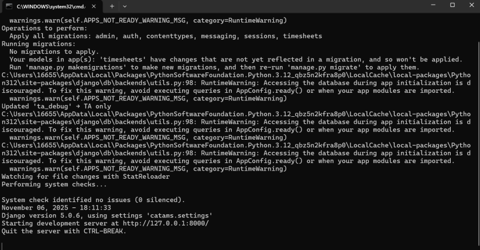

(optional->web server, you can check it or jump this step)
After start the server on localhost, Download ngrok, create account and set up. Tips: You can read docs of ngrok in this network: https://ngrok.com/docs/what-is-ngrok to learn how to use it.
After set up, click the ngork.exe, and input ‘ngrok http 8000’，and see this interface:

Input the url in the line “Forwarding” in any remote laptop, and you can open our system! The interface work on local/remote.

 

# 2, login function
Input any one of our demo account as user name, and pass1234 as password.

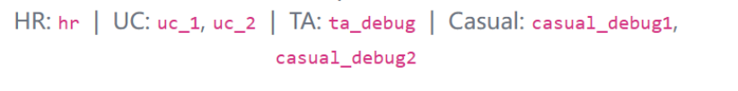

# 3, Create account
Login as HR,  click the button “create account” below left side “menu”.

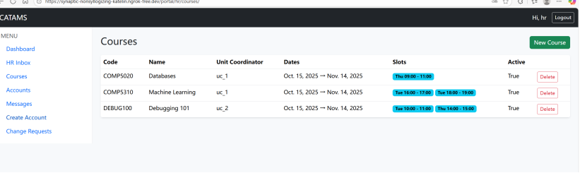

Select username, password and role for them. If you create a TA account or casual account, you can choose it to be a phd or non-phd account.

Click the button account to see all accounts!

# 4, Create course
Click the button course or dashboard, to see the courses we have(You can check the unit coordinator of each course in this page):

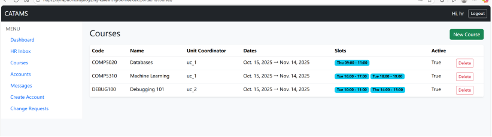

Click the button new course, to see this interface:

Enter code, name, UC, budget, start/end time, time slots of the course, and save.
Notice: In this project, we will use a demo account and a course for demonstration. If you would like to use more accounts for testing, you can create your own courses or accounts, but we recommend that you first follow the instructions below to operate with the demo accounts and course.
# 5, TA application
Login by any TA account, and click the button TA Request, the blue button “Apply as TA” can go to the TA apply interface, while “My TA Application” button can go to request check interface.

Choose the course, (we choose comp5310), and submit it.(Click the Dashboard button so the menu can recover, please do it at anytime you find the buttons under menu change)

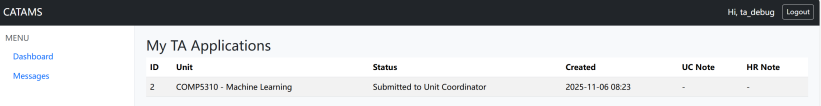

Logout and use UC account login. The UC of comp5310 is uc_1.

Click “unit coordinator inbox in the left side”, and click “Open TA Request Inbox”.

Choose “Forward to HR” or reject.
Use HR login, click the button “HR Inbox” under menu, and click “Open TA Request Inbox”.

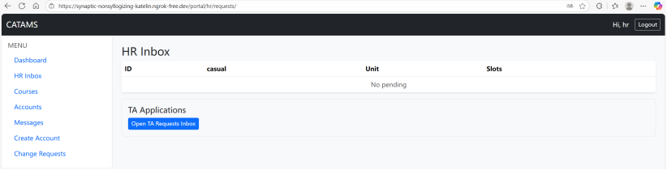

Choose approve or reject. The workflow complete. TA can find this/her course now!

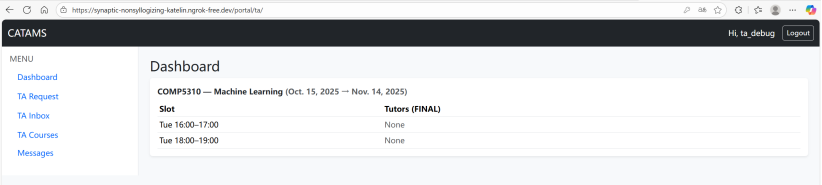

# 6, Casual application
Login as causal, and see this interface(Dashboard/My request)

Click the green button “new”, to enter this interface

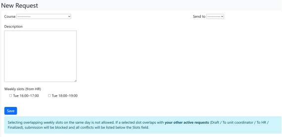

Choose course(we choose comp5310), send to who(UC or TA of this course, we choose TA), and time(we choose 16:00-17:00). Save application. 

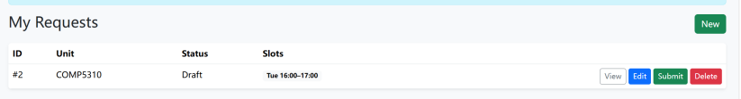

You can submit, edit, or delete it. Let’s submit the application.
Use the account of TA or UC of this course. (We choose send to TA, so use ta_debug).  
Click ta_inbox under menu, enter comment and forward to UC.

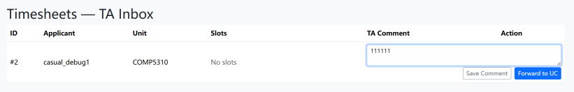

Use the account of UC of this courses to login(use uc_1 to login this time). Click unit coordinator inbox under menu. Click View TA comment to see the comment of TA, choose approve or reject button.(Choose approve to continue)

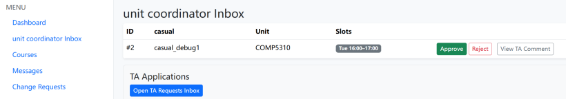

Use HR login, and click HR inbox under menu, approve(finalize) or reject it.

Casual can check his/her application:

Click “view” to see detail(hourly rate and total pay of this course) of application, or resubmit it. We can see the hourly rate is for non-phd user. You can check whether a casual is a phd or not by click the button “My profile”. 

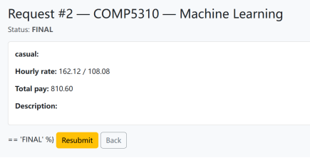

# 7, Time slot change(allocation) function
Use a UC account to login(we use uc_1), click “change request” under menu.

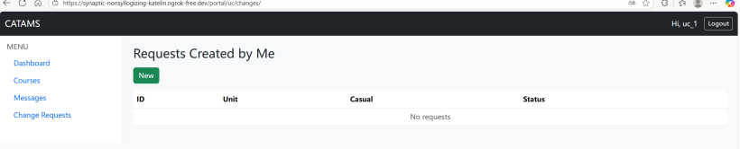

Click the “New” button.

Choose target casual and time slots(if you want to choose multiple slots, push ctrl and click). We choose two slots for casual_debug1. Save and send.
Use casual login(Casual_debug1), click change request button under menu. Approve or reject it.

After approve, use HR login. Click the change request button under menu, choose approve or reject.

We can see that the new time slots has already change, casual_debug1 has two time slots now(you can see it in dashboard of UC_1 or ta_debug):

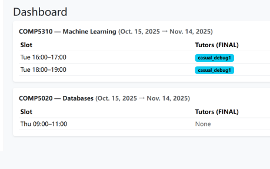

And you can also see the new slots in casual’s dashboard.

# 8, Total hour add/subtract
Login by UC_1 account, click the button courses under menu. Both UC and TA has this function, so you can also use ta_debug to test this function.

If you click the button view, you can see the detail of this course:
For comp5310, we can see the casual and TA of this course, and hourly rate, total pay of each casual, and budget use of this course.

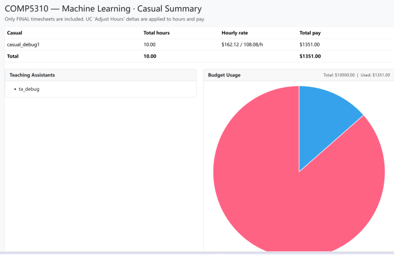

If you Click ‘adjust’ button in the last interface(My Courses),  choose hourly rate(first time/repeat hourly rate), and add/subtract hours, positive number for add, negative number for subtract. Click save.

This function will take effective immediately, and doesn’t have a workflow.  We add 1 hour, and choose repeat rate, and let’s see what happen:

UC/TA(My course->view):

Casual(My request->view):

# 9, Message
Use any account to login, and click message button under menu, click compose, choose target user, subject and input information. Sent this message.

Use the target’s account login(uc_1), click inbox and see the message:

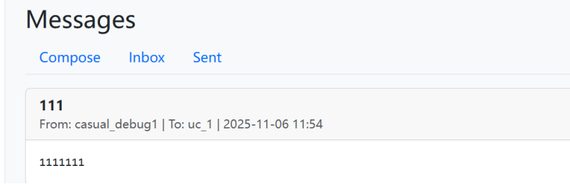
